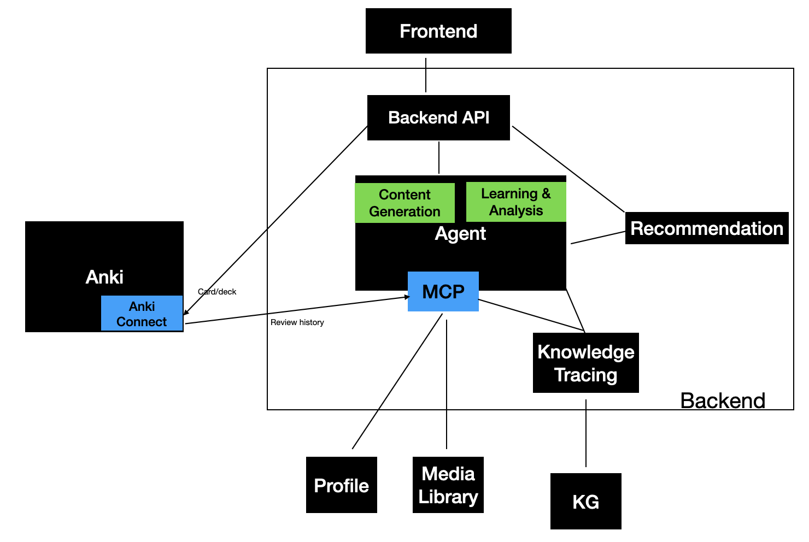

# SRS4Autism: An AI-Powered Learning Co-pilot

## 1. Vision & Mission

**SRS4Autism** is an intelligent learning ecosystem designed to provide hyper-personalized education for autistic children. The core mission is to leverage the proven power of Spaced Repetition Systems (SRS) while dramatically reducing the content creation burden on caregivers through a sophisticated AI assistant.

The system is built around a central **AI Agent** that acts as a bridge between two worlds:

1. **The Child's Internal World:** A deep, real-time understanding of the child's knowledge state, interests, and learning patterns.
    
2. **The External World Model:** A structured representation of knowledge (language, concepts, social skills) in the form of an ontology or Knowledge Graph.
    

The Agent's goal is to find the most effective and engaging path to help the child's internal model grow and align with the external world, evolving beyond a simple learning tool to become a true educational partner.

## 2. Core Principles

This platform is built on three foundational axioms that create its Unique Value Proposition (UVP):

- ✅ **SRS as the Proven Methodology:** We start with a scientifically validated technique that is highly effective for knowledge acquisition, particularly for learners with working memory challenges. It acts as a cognitive scaffold, offloading the mental burden of scheduling reviews.
    
- 🤖 **AI as the Efficiency Multiplier:** The single greatest barrier to effective SRS is the high friction and time cost of creating high-quality, personalized content. Our AI Agent reduces this "Ankiization" cost by an order of magnitude, turning a photo, an event, or a simple prompt into a curated set of flashcards in seconds.
    
- 🧠 **Knowledge Tracing as the Intelligent Navigator:** The system is more than a content mill. By using a Knowledge Graph and actively tracing the child's mastery of each concept, the Agent doesn't just make _more_ content; it makes the _right_ content at the _right_ time, ensuring a logical and efficient learning path.
    

## 3. System Architecture

The system is designed as a continuous, intelligent loop of **`Generate -> Curate -> Learn -> Analyze -> Recommend`**.

This architecture is composed of three key data flows:

- **Content Creation Flow (User-Driven):** The caregiver interacts with the **Frontend** to request content. The **Agent** uses the **MCP (Model Context Protocol)** to provide rich context to the **Content Generation** module. The output is sent to a **Curation** area before being pushed to Anki.
    
- **Learning Feedback Loop (Analysis):** This is the core of the system's intelligence. **AnkiConnect** sends `Review History` back to the backend. The **Knowledge Tracing** engine analyzes this data, cross-referencing it with the **Knowledge Graph**, to update the **MCP** with the child's real-time knowledge state.
    
- **Proactive Recommendation Flow (AI-Driven):** The **Recommendation** engine periodically asks the Agent for the optimal next learning step. By comparing the child's current knowledge in the MCP with the map of all concepts in the Knowledge Graph, it identifies and automatically generates content for the most logical next topic.
    

## 4. The MVP (Minimum Viable Product)

The MVP is strategically focused on **foundational vocabulary acquisition using Anki**.

This approach provides immediate value by targeting the most common use case for SRS and directly addressing working memory challenges. It allows us to build the "bricks" of language (vocabulary) before needing the complete architectural blueprint (the full Knowledge Graph) for grammar and abstract concepts.

## 5. Proposed Technology Stack

- **Frontend:** A standalone **Web Application** (React, Vue, etc.) accessed via `localhost` for personal use.
    
- **Backend:** A **Python** web framework (Flask or FastAPI).
    
- **AI / ML:**
    
    - **Content Generation:** Large Language Models (Gemini, GPT series).
        
    - **Text-to-Speech:** Google Cloud Text-to-Speech (WaveNet voices).
        
    - **Image Generation:** Stable Diffusion, Midjourney, or DALL-E.
        
- **Data Layer:**
    
    - **Knowledge Graph:** Neo4j or Amazon Neptune.
        
    - **Profile & Content DB:** PostgreSQL or MongoDB.
        
- **Bridge to Anki:** The official **AnkiConnect** add-on.
    

## 6. Development Roadmap

The project will be developed in layers, building upon the established foundation.

- **Layer 1 (MVP): Basic Cognition**
    
    - **Naming:** Mapping objects to spoken words (receptive vocabulary).
        
    - **Basic Abstraction:** Concepts like color, shape, size, and quantity.
        
    - **Literacy Foundation:** Pinyin and high-frequency Chinese characters.
        
- **Layer 2: Building Sentences**
    
    - Introduce core grammar points from the Knowledge Graph.
        
    - Generate simple sentence structures using mastered vocabulary.
        
    - Teach abstract concepts that require sentence-level context.
        
- **Layer 3: Situational Language**
    
    - Generate simple, situational dialogues (e.g., ordering food, greeting someone).
        
    - Create AI-generated social stories based on the child's life events (from the Media Library).
        
- **Future (Commercial Version):**
    
    - Transition from a `localhost` model to a hosted web application.
        
    - Develop a lightweight desktop companion app to securely bridge the web app with the user's local AnkiConnect instance.