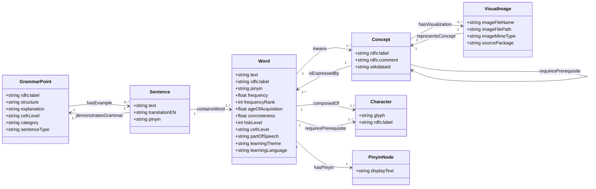

# Knowledge Graph Schema Visualization (v2.0)

**Status:** Reverse Engineered from `world_model_rescued.ttl`
**Date:** 2026-01-29

This diagram represents the *actual* structure of the data currently in the Knowledge Graph.

## The Core Model

## Schema Health Analysis (Technical Debt)

Based on the audit of the current data, the following inconsistencies must be resolved:

### 1. Property Redundancy
| Class | Issue | Recommendation |
|---|---|---|
| **Word** | Has both `text` and `rdfs:label`. | **Standardize on `rdfs:label`** for display text. |
| **Sentence** | Has `demonstratesGrammar` and `illustratesGrammar`. | **Pick `illustratesGrammar`** as standard. |
| **Concept** | Has `requiresPrerequisite` pointing to other Concepts. | Keep distinct from Word prerequisites. |

### 2. The Pinyin Situation
*   **Current State:** `hasPinyin` links to URIs, not literals.
*   **Action:** Explicitly define `srs-kg:PinyinSyllable` in the ontology.

### 3. Sentence Data Scarcity
*   **Issue:** Audit shows very low counts for Sentence properties.
*   **Action:** Verify Sentence deck population scripts.
